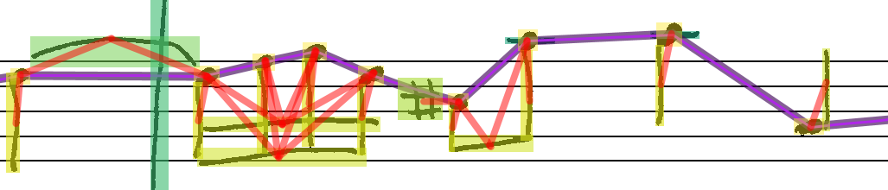

# MuNG Linker

Experiments on linking the nodes of a music notation graph (MuNG). The basic idea is to machine-learn
the relations from images between objects in a notation graph.
So starting with the detected object in an image, we want the machine to learn how to construct 
a [Music Notationg Graph](https://github.com/OMR-Research/mung) like this:

One way how this can be done is by training a convolutional neural network to take the output of an 
object detector and for each pair of objects decides whether an edge between them should be constructed or not.

More information can be found in the [ISMIR paper](https://archives.ismir.net/ismir2019/paper/000006.pdf).

## Requirements

- Python 3.6 / 3.7
- [PyTorch](https://pytorch.org/)

Install the sources with ``pip install -e .`` to follow updates without having to re-install.

## Dataset
Download the MUSCIMA++ dataset with the required images, by running 

`python munglinker/prepare_dataset.py`

or manually download the [MUSCIMA++ dataset](https://lindat.mff.cuni.cz/repository/xmlui/handle/11372/LRT-2372) and extract the xml-files from `data/cropobjects_withstaff` into `data/mungs` as well as the used images from the [CVC-MUSCIMA](http://www.cvc.uab.es/cvcmuscima/index_database.html) dataset from [here](https://github.com/apacha/OMR-Datasets/releases/download/datasets/CVC_MUSCIMA_PP_Annotated-Images.zip) into `data/images`

## Training
Run the training by calling:

`python munglinker/train.py`